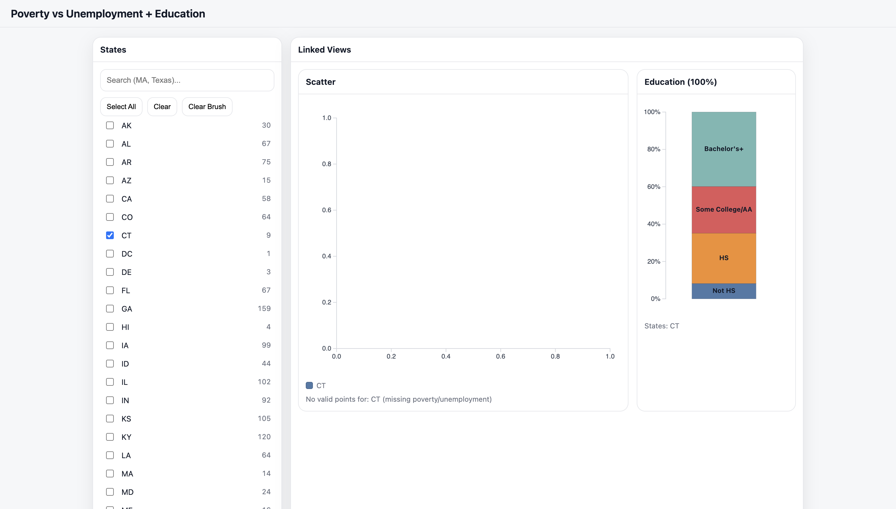

# CS4804 A4 - Linked Views
# Poverty vs Unemployment + Education - Joel Indipiginja

# Project Structure

- Code lives in:
  - `index.html` (all D3 + layout + styling)
  - `data/datagen.py` (merges the datasets into one CSV that is used for everything)
  - `data/merged_county_edu_unemp_poverty.csv` (final merged data file used by the visualization)

# Working Link

- https://jindipiginja.github.io/a4-linkedviews/index.html

# Concise Description + Screenshot

- This visualization uses 2023 U.S. county-level data from the USDA ERS County-Level Data Sets:
  - https://www.ers.usda.gov/data-products/county-level-data-setscounty-level-data-sets-download-data

- The main view is a county scatterplot that compares poverty rate (2023) vs unemployment rate (2023). The second linked view is a stacked education composition chart based on four categories that sum to 100% (Not HS, HS, Some College/AA, Bachelor’s+). This is important because poverty and unemployment are usually talked about separately, but plotting them together makes patterns and outliers obvious, and the education breakdown helps explain why certain counties end up where they do. I got this idea after I wrote my most recent reflections looking at unemployement rate and poverty rates in the US, and my first natural thought was to wonder about the education rates of the counties and the impacts that each have on each other. That is the reason I decided to make this visualization.

- 

## How To Use My Visualization

- Select one or more states from the list on the left, and the clear buttons allow you to easily select and deselect certain options.
- Counties appear as points in the scatterplot:
  - X axis: Poverty rate (2023) (%)
  - Y axis: Unemployment rate (2023) (%)
- Hover a point to see a tooltip with county-level details.
- Brush (click + drag) to select a group of counties, which updates the education composition.
- Click a county to lock it as the active selection.
- Click a stacked bar segment (education category) to highlight counties in the scatterplot that are “high” in that category relative to the currently selected data.

# Notes/Limitations 
Some states (ex: CT) may not display points if poverty/unemployment values, from the census data, are missing after the 3-way merge. The visualization handles this by filtering invalid points and showing an on-screen message, but it means coverage depends on which counties exist across all sources. If poverty/unemployment values are missing, the education graph still shows and depicts the values for the overall state. 

- 

# ChatGPT usage

- I used AI tools for multiple aspects of this project, but not for actual code generation.
- Examples include: helping me with the dataset joining, how to deal with certain states'  missing data, figuring out the button functionality, helping me understand the filtering and how to automatically generate the legend/colors, linking both visualizations together, getting the tooltip to show properly and overall code debugging

# Technical Achievements

## Brushing + linking:
  - Brush selection on the scatterplot updates the stacked education view to show the data based on the county(ies).
  - You can select multiple counties by holding the mouse and dragging a box so that you can see the education averages of multiple specific counties. 
  - Clicking education segments triggers a reverse highlight back onto the scatterplot and highlights only the points where that county’s value is greater than or equal to the education value that was selected.

## State filtering UI:
  - Multi-select checkbox list + search bar + button functionality that allows you to select/deselect all and certain filters on the visualization for easy usage. 
  - Automatically generates legend showing selected states and their colors.

## Data joining pipeline:
  - Merged three county datasets (education + unemployment + poverty) using county FIPS codes as the key.
  - Pivoted the source format (Attribute/Value rows) into wide columns needed for visualization.
  - Output is a single clean CSV used directly by D3.

## NaN handling + warnings:
  - Prevented missing values from turning into 0s (which broke the scatterplot and axes).
  - Filtered invalid poverty/unemployment pairs so the plotted points are trustworthy.
  - Displays a message when a selected state has no valid points (data coverage limitation after merge).

# Design Achievements

## Linked views:
  - Scatterplot makes poverty vs unemployment relationships visible.
  - For States, you can see the overall trend of the data, and for individual counties you can use the tooltip to see the specific metrics. 
  - 100% stacked education chart acts like an explanation layer for selected points/regions and still displays information below from the scatter for an extra layer of comparison/understanding.

## Coloring + legend:
  - Counties are colored by state, and a legend is generated dynamically based on what’s selected.

## Tooltips :
  - Scatterplot tooltip shows county name + key metrics (poverty %, unemployment %, education %, median income).
  - Stacked bar tooltip shows segment share for the state or the individual/multiple counties selected.

